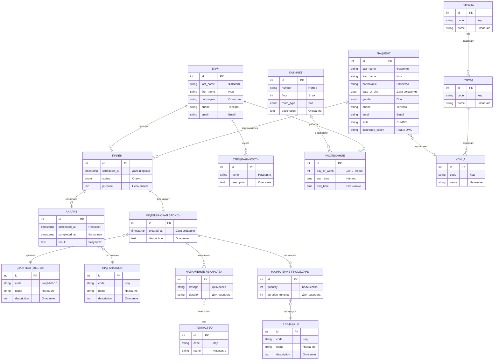

# Концептуальная модель данных "Поликлиника"

## ER-диаграмма (Mermaid)



---

## Как сгенерировать картинку

### Вариант 1: VS Code
1. Установи расширение "Markdown Preview Mermaid Support"
2. Открой этот файл и нажми Ctrl+Shift+V

### Вариант 2: Онлайн
1. Открой https://mermaid.live
2. Скопируй код диаграммы (между ```mermaid и ```)
3. Скачай как PNG/SVG

### Вариант 3: PlantUML
1. Открой https://www.plantuml.com/plantuml/uml
2. Загрузи файл `conceptual_model.puml`
3. Скачай как PNG/SVG

---

## Описание сущностей

### Основные сущности

| Сущность | Описание |
|----------|----------|
| ПАЦИЕНТ | Физическое лицо, обращающееся за медицинской помощью |
| ВРАЧ | Медицинский работник, оказывающий помощь |
| ПРИЁМ | Запланированный или состоявшийся визит пациента к врачу |
| МЕДИЦИНСКАЯ ЗАПИСЬ | Результат приёма: осмотр, диагноз, назначения |

### Справочники

| Сущность | Описание |
|----------|----------|
| СПЕЦИАЛЬНОСТЬ | Медицинская специализация врача (терапевт, кардиолог...) |
| КАБИНЕТ | Помещение поликлиники для приёма пациентов |
| ДИАГНОЗ | Код и название заболевания по МКБ-10 |
| ЛЕКАРСТВО | Медицинский препарат для назначения |
| ПРОЦЕДУРА | Медицинская манипуляция (ЭКГ, УЗИ, инъекция...) |
| ВИД АНАЛИЗА | Тип лабораторного исследования |

### Связи (кардинальность)

| Связь | Тип | Описание |
|-------|-----|----------|
| Пациент → Приём | 1:N | Один пациент может иметь много приёмов |
| Врач → Приём | 1:N | Один врач проводит много приёмов |
| Врач ↔ Специальность | M:N | Врач может иметь несколько специальностей |
| Врач ↔ Кабинет | M:N | Расписание работы врачей в кабинетах |
| Приём → Мед. запись | 1:1 | Один приём = одна запись |
| Мед. запись → Назначения | 1:N | Одна запись может содержать много назначений |
| Приём → Анализы | 1:N | На приёме могут назначить несколько анализов |
